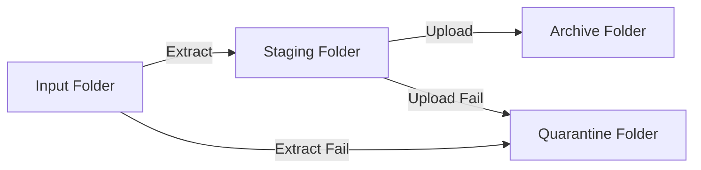

# Invisible Invoice Bot

A serverless automation tool that fetches PDF invoices from email, extracts data using Google Gemini AI, and automatically enters it into the Infocon WebEDI Portal using a headless browser.

## 🚀 Overview

*   **Goal:** Automate invoice processing for ~1,000 invoices/month.
*   **Stack:** Python, Playwright, Google Gemini 2.5 Flash.
*   **Experience:** Drag-and-drop. Save a PDF/Image to `invoices/input` -> Data appears in the portal.

## 🛠️ Architecture: The "Quarantine" Workflow

The system uses a "Safety First" pipeline to ensure no data is lost and errors are easy to fix.



1.  **Input (`invoices/input`):**
    *   Place your PDF or Image files here.
    *   The bot scans this folder, extracts data using AI, and saves a `.json` file to Staging.

2.  **Staging (`invoices/staging`):**
    *   This is the "Outbox". Files here have valid JSON data and are waiting to be uploaded.
    *   *Power User Tip:* You can pause the script here to inspect/edit JSON files before they are uploaded.

3.  **Archive (`invoices/archive`):**
    *   **Success!** Once uploaded to the portal, files (both PDF and JSON log) are moved here, organized by date.

4.  **Quarantine (`invoices/quarantine`):**
    *   **Failure.** If *anything* goes wrong (bad PDF, AI fail, Portal down), files are moved here.
    *   **How to Fix:**
        *   **Extraction Error:** Check the PDF. If valid, move it back to `Input`.
        *   **Upload Error:** Open the JSON file in `Quarantine`. Fix any data errors (e.g., missing BOL #). Move the JSON (and PDF) back to `Staging`. Run the bot.

## ⚙️ Setup & Configuration

### Prerequisites

*   Python 3.10+
*   A Google Cloud Project with Gemini API Access.
*   Infocon WebEDI Portal credentials.

### Environment Variables

| Variable | Description |
| :--- | :--- |
| `GEMINI_KEY` | **Required.** Google Gemini API Key. |
| `PORTAL_USER` | (Future) Infocon Portal Username. |
| `PORTAL_PASS` | (Future) Infocon Portal Password. |

### Local Installation

1.  **Clone the repository:**
    ```bash
    git clone https://github.com/highly-illiquid/route_runner.git
    cd route_runner
    ```

2.  **Install dependencies:**
    ```bash
    # Use a virtual environment (recommended)
    python -m venv venv
    source venv/bin/activate
    pip install -r requirements.txt
    playwright install chromium
    ```

3.  **Prepare Directories:**
    ```bash
    # The script creates these automatically, but good to know:
    mkdir -p invoices/input invoices/staging invoices/archive invoices/quarantine
    ```

4.  **Run the bot:**
    ```bash
    python main.py
    ```

## 🤖 Automation

The script runs in three phases automatically:
1.  **Phase 1:** Retry uploading any old files left in `Staging`.
2.  **Phase 2:** Extract new files from `Input` and move them to `Staging`.
3.  **Phase 3:** Upload the newly extracted files from `Staging`.


## 📂 Project Structure

```
route_runner/
├── .github/workflows/   # GitHub Actions CI/CD configuration
├── memory_bank/         # Project documentation & context
├── src/
│   ├── ai_extractor.py  # Gemini API integration
│   ├── email_client.py  # IMAP fetch & SMTP send logic
│   ├── models.py        # Pydantic data models
│   └── portal_bot.py    # Playwright browser automation
├── main.py              # Entry point / Orchestrator
├── requirements.txt     # Python dependencies
└── README.md            # This file
```

## 🤖 Automation

The project is configured to run automatically via GitHub Actions. See `.github/workflows/invoice-bot.yml` for the schedule configuration.

## 📄 License

[MIT](LICENSE)
